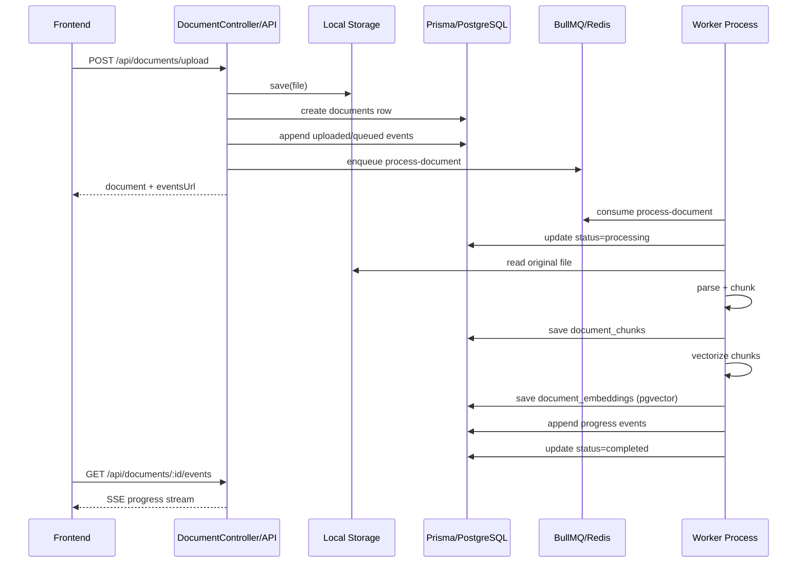
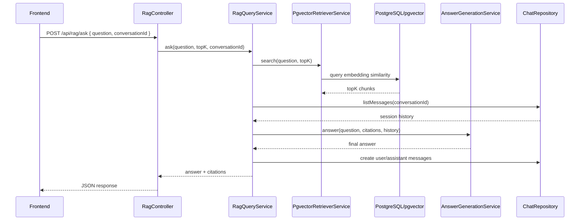

# 文档处理链路

当前实现围绕 `Document -> Chunk -> Embedding -> PostgreSQL(pgvector)` 展开，数据库访问统一走 `PrismaService`。

需要先明确 4 个角色：

- `Prisma`：数据库访问主入口，负责 documents / chunks / events 的常规 CRUD
- `Prisma raw SQL`：用于 `pgvector` 列的写入与读取，仍然挂在 `PrismaService` 上
- `BullMQ`：负责异步任务排队、调度、重试
- `worker`：负责消费队列并执行重任务

当前代码里已经拆出了独立的 `langchain/` 目录，并接入了 embedding repository 与基础问答链路。
后续如果做在线问答，更适合继续在这个独立目录下扩展 retrieval / prompt / model / tools 编排，而不是放到文档入库 worker 里。

## 当前状态

- `Prisma` 已接通本地 PostgreSQL
- `pgvector` 扩展已在 `assistant` 数据库启用
- 文档入库链路已经完成一次端到端验证
- `BullMQ` / `worker` 的队列消费已接通本地 Redis
- Redis 采用 `redis-memory-server` 以 npm 依赖方式启动，不依赖系统级 Redis 安装
- worker 内部的 `DocumentProcessingService` 与真实 BullMQ 队列都已验证可完成 `parse -> chunk -> embedding -> pgvector` 持久化

## 目标

- 上传后立即可查
- 处理过程可通过 SSE 观察
- 文档元数据、分块、向量都持久化
- 后续替换 embedding repository 时不改业务编排
- 数据库访问统一收口到 Prisma

## 目录结构

```text
services/src/modules/document/
├── document.controller.ts
├── document-persistence.module.ts
├── ports/
│   ├── document.repository.port.ts
│   ├── document-artifact.repository.port.ts
│   └── document-event.repository.port.ts
├── repositories/
│   ├── prisma-document.repository.ts
│   ├── prisma-document-artifact.repository.ts
│   ├── prisma-document-event.repository.ts
│   └── in-memory-document-event.repository.ts
├── services/
│   ├── document-artifact-query.service.ts
│   ├── document-upload.service.ts
│   ├── document-queue.service.ts
│   └── document-events.service.ts
│   └── worker/
│       ├── document-processing.service.ts
│       ├── document-parse.service.ts
│       ├── document-vectorize.service.ts
│       └── document-worker.service.ts
└── ...

services/src/langchain/
├── langchain.module.ts
├── embeddings/
│   ├── ports/
│   │   └── embedding.port.ts
│   └── repositories/
│       └── openai-embedding.repository.ts
├── chains/
│   └── answer-generation.service.ts
├── retrievers/
│   └── pgvector-retriever.service.ts
├── prompts/
└── shared/
└── ...

services/src/infra/db/
├── prisma.module.ts
├── prisma.service.ts
└── ...
```

## 总体流程



## 详细流程

1. 前端上传文件到 `POST /api/documents/upload`
2. `DocumentUploadService`：
   - 写入原始文件到本地存储
   - 通过 `PrismaDocumentRepository` 创建文档元数据记录
   - 通过 `DocumentEventsService` 写入 `uploaded` / `queued` 事件
   - 通过 `DocumentQueueService` 投递 BullMQ 任务
   - 到这里为止只做“入队”，不做重解析
3. `DocumentWorkerService`：
   - 作为 worker 消费 BullMQ 任务
   - 按任务类型分发到 `DocumentProcessingService`
4. `DocumentProcessingService`：
   - 更新文档状态为 `processing`
   - 调用 `DocumentParseService` 读取原始文件并切分 chunk
   - 通过 `PrismaDocumentArtifactRepository.saveChunks` 写入 `document_chunks`
   - 调用 `DocumentVectorizeService` 生成 `number[]` embedding
   - 通过 `PrismaDocumentArtifactRepository.saveEmbeddings` 写入 `document_embeddings.embedding::vector`
   - 更新文档状态为 `completed`
5. 前端可通过：
   - `GET /api/documents/:id`
   - `GET /api/documents/:id/artifacts`
   - `GET /api/documents/:id/events`（SSE）

## Prisma 在这条链路中的位置

### 常规表：直接 Prisma model CRUD

下面这些表当前直接走 Prisma model：

- `documents`
- `document_chunks`
- `document_events`

对应实现：

- `PrismaDocumentRepository`
- `PrismaDocumentArtifactRepository.saveChunks`
- `PrismaDocumentEventRepository`

### 向量表：通过 Prisma raw SQL 操作 pgvector

`document_embeddings.embedding` 是 `vector(n)` 类型。当前实现仍然通过 `PrismaService` 访问数据库，但使用的是：

- `transaction.$executeRaw(...)`
- `this.prisma.$queryRaw(...)`

原因很简单：

- Prisma 是数据库访问入口
- `pgvector` 列属于扩展类型
- 因此 embedding 的落库 / 查询使用 Prisma 的 raw SQL 能力来完成

这意味着现在的数据库访问方式是：

- 普通结构化数据：Prisma model CRUD
- 向量列：Prisma raw SQL

不是“绕过 Prisma”，而是“在 Prisma 边界内处理 pgvector”

## 组件职责边界

### BullMQ

- 负责 `process-document`、`rebuild-document-index` 这类任务的排队与调度
- 负责失败重试、延迟执行、并发消费等队列能力
- 不承载解析、向量化这些具体业务代码

### worker

- 负责消费队列任务
- 负责运行高耗时、可异步化的任务
- 当前实现入口是 `services/src/worker/main.ts`

### DocumentProcessingService

- 负责文档处理主流程编排
- 负责串联 parser、artifact repository、vectorizer、events
- 属于 worker 内部的业务服务，而不是队列基础设施本身

### LangChain.js

- 当前已作为独立目录承接 embedding repository、retriever、基础 answer chain
- 会话级上下文问答已接入，后续还可以继续扩展更完整的 LangChain orchestration
- 更适合继续承接例如：
  - query rewrite
  - retriever orchestration
  - tool calling
  - answer synthesis

## Embedding -> 向量 -> 检索是否已经处理好

结论先说：

- `是，当前已经完成 embedding 生成、pgvector 落库、向量召回检索`
- `并且已经接通基础 RAG 问答链路与会话历史注入`

### 已经完成的部分

1. `DocumentVectorizeService`
   - 把每个 chunk 转成 `number[]`
   - 当前通过独立的 `langchain` embedding repository 调用 OpenAI `text-embedding-v4`
2. `PrismaDocumentArtifactRepository.saveEmbeddings`
   - 把 `number[]` 转成 `"[...]"` 形式的 vector literal
   - 通过 `INSERT ... ${literal}::vector` 写入 `document_embeddings`
3. `PrismaService.ensureSchema`
   - 启动时确保 `pgvector` 扩展存在
   - 自动创建 `document_embeddings.embedding vector(n)` 列
4. `GET /api/documents/:id/artifacts`
   - 已经可以把 chunks 和 embeddings 读出来，验证落库结果
5. `PgvectorRetrieverService`
   - 对用户 query 生成 embedding
   - 使用 `ORDER BY embedding <=> query_vector` 执行相似度检索
   - 返回 `documentId / chunkId / text / score`
6. `RagQueryService`
   - 串联 `retriever -> answer generation`
   - 支持传入 `conversationId`
   - 会从 `chat_messages` 读取历史消息注入回答上下文
   - 问答结束后把 `user / assistant` 消息持久化到会话表

### 当前已接通的在线问答链路



所以更准确的说法是：

- 文档入库侧的 `embedding -> vector` 持久化已经完成
- 在线查询侧的 `query embedding -> pgvector retrieval -> answer generation` 也已经接通
- 当前剩余的增强项主要是“流式输出”“引用信息历史持久化”“更完整的 LangChain 编排抽象”

## 已完成验证

验证脚本：

- `services/scripts/verify-document-pipeline.ts`
- `services/scripts/verify-bullmq-document-pipeline.ts`

验证结果：

- 成功写入 `documents`：`1`
- 成功写入 `document_chunks`：`1`
- 成功写入 `document_embeddings`：`1`
- 成功生成 12 维向量并写入 `pgvector`
- 成功通过 BullMQ 队列异步消费文档任务

这说明当前已经跑通：

1. 文档元数据入库
2. 原始文件解析
3. chunk 持久化
4. embedding 生成
5. `vector(n)` 向量落库
6. BullMQ 异步任务消费

## 本地开发启动方式

本地 Redis 采用 npm 依赖启动：

- 后端联调一键启动：`pnpm dev:backend`
- 仅前端启动：`pnpm dev:web`
- 如果需要分别调试，也可以单独启动：
  - API：`pnpm --dir services dev`
  - worker：`pnpm --dir services worker:dev`
  - Redis：`pnpm --dir services redis:dev`

- Redis 地址：`redis://127.0.0.1:6379`
- 配置文件：`services/.env.local`

验证过的本地链路：

1. 启动 PostgreSQL
2. 启动 `redis:dev`
3. 启动 API / worker，或直接运行验证脚本
4. 上传文档后由 BullMQ 投递任务
5. worker 消费任务并完成入库与向量化

## 数据存储

### documents 表

保存文档元数据：

- `id`
- `title`
- `original_name`
- `mime_type`
- `size`
- `storage_path`
- `status`
- `progress`
- `created_at`
- `updated_at`
- `error_message`

### document_chunks 表

保存解析后的文本分块：

- `chunk_index`
- `text`
- `character_count`
- `token_count`
- `start_offset`
- `end_offset`

### document_embeddings 表

保存向量数据，`embedding` 列使用 `vector(n)`：

- `id`
- `document_id`
- `chunk_id`
- `model`
- `dimension`
- `embedding`
- `created_at`

## 处理阶段

- `uploaded`：文件已接收并写入本地存储
- `queued`：任务已进入队列
- `parsing`：文档解析和分块
- `chunking`：完成 chunk 输出
- `vectorizing`：生成并落库 embedding
- `completed`：全部流程完成
- `failed`：任一阶段失败

## 当前约束

- 原始文件仍保留在本地磁盘，适合当前“文档很少”的本地开发场景
- 向量生成已拆成独立服务，后续可以直接替换为 OpenAI / Azure OpenAI / Voyage / Jina / BGE 等 repository 实现
- PostgreSQL 连接通过 `DATABASE_URL` 配置，`pgvector` 由 `PrismaService` 启动时自动初始化
- `document_embeddings` 目前通过 Prisma raw SQL 读写，而不是普通 model CRUD
- 当前 `@langchain/*` 依赖已安装，但还没有在文档入库链路中正式接线
