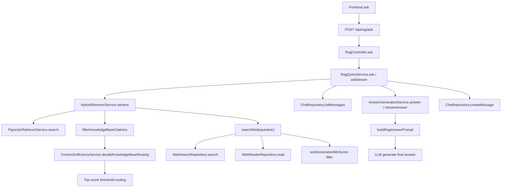

# RAG Routing / Retrieval / Generation Pipeline

这份文档描述当前在线问答链路里 `request -> retrieval -> routing -> generation -> persistence` 的完整流程。文档内容以当前代码为准，重点补充这些容易误解的点：

- 召回结果现在不是原样进入生成，而是会先做生成前过滤
- `citations` 是生成阶段可用的上下文集合，不是“唯一证据”
- `score` 是相关性分数，不是向量本身
- 历史会话只在生成阶段使用，不参与向量召回
- 生成 prompt 已拆分到独立的 prompt builder，并对 `knowledge_base / search / none` 做了细分

如果要排查“为什么走了 search”“为什么这次 citations 变少了”“为什么回答忽略了某条召回结果”，建议按本文顺序读。

## 1. 目标

当前系统支持两类上下文来源：

- 知识库：本地文档 chunk + pgvector
- Web Search：默认 `Jina Search + Jina Reader`，默认走 `https://s.jinaai.cn` / `https://r.jinaai.cn`，也预留 `Tavily`

系统会把每次请求路由到 3 种模式之一：

- `knowledge_base`
- `search`
- `none`

同时支持可选会话上下文：

- 如果传入 `conversationId`，会读取历史会话消息
- 历史消息用于回答生成，不参与向量召回

## 2. 整体流程



可以把这条链路理解成 5 步：

1. Controller 接收请求，决定返回 `json` 还是 `stream`
2. Query Service 调用 Hybrid Retriever 获取 `retrievalMode + routingReason + citations`
3. 如果有 `conversationId`，读取历史会话
4. Generation Service 基于 `question + citations + retrievalMode + history` 组装 prompt 并调用 LLM
5. 回答完成后，如果有会话，则把本轮 user / assistant 消息落库

## 3. 请求入口

主要文件：

- [services/src/modules/rag/rag.controller.ts](/Users/admin/Desktop/works/learn/assistant/services/src/modules/rag/rag.controller.ts)
- [services/src/modules/rag/services/rag-query.service.ts](/Users/admin/Desktop/works/learn/assistant/services/src/modules/rag/services/rag-query.service.ts)
- [packages/shared/src/rag/rag.types.ts](/Users/admin/Desktop/works/learn/assistant/packages/shared/src/rag/rag.types.ts)

共享请求结构：

```ts
export interface RagAskRequest {
  question: string
  topK?: number
  conversationId?: string
}
```

字段含义：

- `question`：当前用户问题
- `topK`：知识库向量召回上限
- `conversationId`：可选，会触发历史会话读取与回答落库

Controller 核心逻辑：

```ts
const responseMode = resolveResponseMode(request.headers)

if (responseMode === "stream") {
  const response = await this.ragQueryService.askStream(
    body.question,
    body.topK,
    body.conversationId,
  )
}

const response = await this.ragQueryService.ask(
  body.question,
  body.topK,
  body.conversationId,
)
```

当前支持两种响应模式：

- `json`：整包返回 `question / answer / retrievalMode / routingReason / citations`
- `stream`：先发 `started`，再持续发 `delta`，最后发 `completed`

## 4. Query 编排层

主要文件：

- [services/src/modules/rag/services/rag-query.service.ts](/Users/admin/Desktop/works/learn/assistant/services/src/modules/rag/services/rag-query.service.ts)

这是整条在线链路的编排器，负责串起：

- 检索
- 历史会话读取
- 生成
- 会话持久化

核心代码：

```ts
const retrieval = await this.retriever.retrieve(question, topK)
const history = conversationId
  ? await this.chatRepository.listMessages(conversationId)
  : []
const answer = await this.answerGeneration.answer(
  question,
  retrieval.citations,
  retrieval.retrievalMode,
  history,
)
```

这里有一个很关键的事实：

- 历史会话 `history` 不参与检索
- 历史会话只参与生成

也就是说当前系统不会：

- 用历史消息改写 query
- 用历史消息参与 pgvector 检索
- 用历史消息参与 routing 打分

它只会在生成 prompt 时作为上下文参考。

### 4.1 `ask(...)`

普通 JSON 模式下的顺序是：

1. `retrieve(question, topK)`
2. 如果有 `conversationId`，读取完整消息历史
3. 调用生成服务得到最终答案
4. 如果有 `conversationId`，写入本轮 user / assistant 消息

落库代码：

```ts
if (conversationId) {
  await this.chatQueryService.ensureConversationTitle(conversationId, question)
  await this.chatRepository.createMessage(conversationId, "user", question)
  await this.chatRepository.createMessage(conversationId, "assistant", answer)
}
```

这意味着：

- 生成时读到的是“本轮之前”的历史
- 当前问题和当前回答是在生成完成后才写入数据库

### 4.2 `askStream(...)`

流式模式返回三部分：

- `initial`
- `stream`
- `persist(answer)`

核心结构：

```ts
return {
  initial: {
    question,
    retrievalMode: retrieval.retrievalMode,
    routingReason: retrieval.routingReason,
    citations: retrieval.citations,
  },
  stream: this.answerGeneration.streamAnswer(
    question,
    retrieval.citations,
    retrieval.retrievalMode,
    history,
  ),
  persist: async (answer: string) => {
    if (!conversationId) {
      return
    }
    await this.chatRepository.createMessage(conversationId, "user", question)
    await this.chatRepository.createMessage(conversationId, "assistant", answer)
  },
}
```

这个设计的意义是：

- 前端可以在模型还没生成完时就拿到 `citations / routingReason / retrievalMode`
- 如果用户中断了流式响应，不会把半截 assistant 内容落库

## 5. 检索主流程

主要文件：

- [services/src/langchain/retrievers/hybrid-retriever.service.ts](/Users/admin/Desktop/works/learn/assistant/services/src/langchain/retrievers/hybrid-retriever.service.ts)
- [services/src/langchain/retrievers/pgvector-retriever.service.ts](/Users/admin/Desktop/works/learn/assistant/services/src/langchain/retrievers/pgvector-retriever.service.ts)
- [services/src/langchain/chains/context-sufficiency.service.ts](/Users/admin/Desktop/works/learn/assistant/services/src/langchain/chains/context-sufficiency.service.ts)
- [services/src/config/rag.config.ts](/Users/admin/Desktop/works/learn/assistant/services/src/config/rag.config.ts)

`HybridRetrieverService.retrieve(...)` 是当前检索入口：

```ts
const rawKnowledgeBaseCitations = await this.knowledgeBaseRetriever.search(
  question,
  topK,
)
const knowledgeBaseCitations = this.filterKnowledgeBaseCitations(
  rawKnowledgeBaseCitations,
)
const routing = await this.contextSufficiencyService.decideKnowledgeBaseRouting(
  question,
  knowledgeBaseCitations,
)
const searchAvailable = this.isSearchAvailable()

const needsWebSearch =
  routing.shouldBlendWithWebSearch || routing.shouldFallbackToWebSearch
const webCitations =
  needsWebSearch && searchAvailable ? await this.searchWeb(question) : []
```

现在的执行顺序是：

1. 先做知识库向量召回
2. 对知识库召回结果做生成前过滤
3. 用过滤后的知识库结果进行 routing 判定
4. 只有在 routing 需要且 search provider 可用时才做 web search
5. 对 web 结果也做生成前过滤
6. 根据路由和过滤后结果拼出最终 `citations`

这比旧版本多了一层很重要的变化：

- 进入生成阶段的上下文已经不是原始召回结果
- 而是“召回结果经过生成阈值过滤后的结果”

## 6. 知识库召回

主要文件：

- [services/src/langchain/retrievers/pgvector-retriever.service.ts](/Users/admin/Desktop/works/learn/assistant/services/src/langchain/retrievers/pgvector-retriever.service.ts)

知识库召回逻辑非常直接：

```ts
const embedded = await this.embeddings.embed(question)
const vectorLiteral = `[${embedded.vector.join(",")}]`

const rows = await this.prisma.$queryRaw(
  Prisma.sql`
    SELECT
      de.document_id,
      de.chunk_id,
      dc.text,
      de.embedding <=> ${vectorLiteral}::vector AS distance
    FROM document_embeddings de
    INNER JOIN document_chunks dc ON dc.id = de.chunk_id
    ORDER BY de.embedding <=> ${vectorLiteral}::vector ASC
    LIMIT ${topK}
  `,
)
```

当前逻辑表示：

- 先把用户问题 embedding 化
- 再在 `document_embeddings` 上做向量距离排序
- 最后拿前 `topK` 条 chunk

映射成 citation 时会把距离转为 `score`：

```ts
score: Number((1 - row.distance).toFixed(6))
```

所以知识库 `score` 的本质是：

- `1 - 向量距离`

它是相关性数值，不是 embedding 向量本体。

## 7. 新增的生成前过滤

这是这次代码更新里最重要的变化之一。

### 7.1 知识库结果过滤

`HybridRetrieverService` 新增了 `filterKnowledgeBaseCitations(...)`：

```ts
private filterKnowledgeBaseCitations(citations: RagCitation[]) {
  const minScore = this.configService.get<number>(
    "rag.knowledgeBaseGenerationMinScore",
    0.1,
  )

  return citations.filter(citation => citation.score >= minScore)
}
```

这段逻辑说明：

- 原始向量召回得到的结果，不一定全部进入生成阶段
- 低于 `RAG_KB_GENERATION_MIN_SCORE` 的 chunk 会被直接丢弃

这个过滤不仅影响最终 `citations`，还会影响 routing，因为 routing 用的是过滤后的 `knowledgeBaseCitations`。

也就是说，如果某次检索原始 topK 有结果，但全部低于 `knowledgeBaseGenerationMinScore`，那对 routing 来说等价于：

- “没有可用知识库结果”

最终很可能走 `search` 或 `none`。

另外还有一个前置条件：

- `rag.searchProvider = "jina"` 时，必须存在 `JINA_API_KEY`
- `rag.searchProvider = "tavily"` 时，必须存在 `TAVILY_API_KEY`

否则 retriever 会把 search 视为 unavailable，最后可能回退到 `knowledge_base` 或 `none`。

### 7.2 Web 结果过滤

`searchWeb(...)` 最后也会做最小分数过滤：

```ts
return citations.filter(
  citation =>
    citation.score >=
    this.configService.get<number>("rag.webGenerationMinScore", 0.15),
)
```

这意味着：

- 即使搜索服务返回了多条结果
- 最终只有分数达到 `RAG_WEB_GENERATION_MIN_SCORE` 的结果才会进入生成

因此现在的 `citations` 已经不再是“所有召回候选”，而是：

- “召回 + 最低生成阈值筛选”之后的上下文集合

## 8. Routing 判定

主要文件：

- [services/src/langchain/chains/context-sufficiency.service.ts](/Users/admin/Desktop/works/learn/assistant/services/src/langchain/chains/context-sufficiency.service.ts)

当前 routing 已简化为单阈值判定，不再使用 LLM 做路由兜底。

### 8.1 单阈值路由

核心代码：

```ts
if (citations.length === 0) {
  return {
    shouldFallbackToWebSearch: true,
    reason: "no_knowledge_base_results",
  }
}

if (topScore >= routeThreshold) {
  return {
    shouldUseKnowledgeBaseOnly: true,
    reason: "top_score_above_route_threshold",
  }
}

return {
  shouldFallbackToWebSearch: true,
  reason: "top_score_below_route_threshold",
}
```

可以把这些规则理解成：

- 没结果，走 `search`
- 顶部分数 `>= RAG_KB_ROUTE_THRESHOLD`，走 `knowledge_base`
- 顶部分数 `< RAG_KB_ROUTE_THRESHOLD`，走 `search`

`RAG_KB_ROUTE_THRESHOLD` 支持两种写法：

- `0.85`
- `8.5`

如果配置值大于 `1`，系统会自动按 `10` 分制换算成 `0-1` 的相似度阈值。

对应 `routingReason` 分别会落成：

- `llm_routing_knowledge_base`
- `llm_routing_hybrid`
- `llm_routing_search`

如果 LLM routing 本身报错，再回退到规则近似结论：

- `rule_fallback_after_llm_error`

## 9. 最终 retrievalMode 如何确定

最终模式拼装仍在 `HybridRetrieverService.retrieve(...)`：

```ts
if (routing.shouldUseKnowledgeBaseOnly && webCitations.length === 0) {
  return {
    retrievalMode: "knowledge_base",
    citations: knowledgeBaseCitations,
  }
}

if (
  (routing.shouldBlendWithWebSearch || routing.shouldUseKnowledgeBaseOnly) &&
  knowledgeBaseCitations.length > 0 &&
  webCitations.length > 0
) {
  return {
    retrievalMode: "hybrid",
    citations: [...knowledgeBaseCitations, ...webCitations],
  }
}

if (webCitations.length > 0) {
  return {
    retrievalMode: "search",
    citations: webCitations,
  }
}

if (knowledgeBaseCitations.length > 0) {
  return {
    retrievalMode: "knowledge_base",
    citations: knowledgeBaseCitations,
  }
}

return {
  retrievalMode: "none",
  citations: [],
}
```

实际含义：

- 只有知识库结果时，走 `knowledge_base`
- 知识库和 web 都有结果时，走 `hybrid`
- 只有 web 结果时，走 `search`
- 两边都没有时，走 `none`

这里要注意：

- `none` 模式现在是完整的一等分支，不是隐式异常情况
- 它会继续进入生成层，但生成层会使用“无可信上下文”的专门 prompt

## 10. 为什么还会返回多条 citations

当前系统返回的 `citations` 仍然不是“唯一命中的证据”，而是：

- 最终允许进入生成阶段的上下文集合

只是和旧版本相比，现在它多了一层过滤。

当前仍然没有做这些事：

- 文本去重
- `documentId` 去重
- `hybrid` 结果 rerank
- source merge

所以依然可能出现：

- 多条内容很像的知识库 chunk
- 多条 web 结果同时进入上下文
- `hybrid` 下知识库和 web 结果直接拼接

只是现在比旧实现多了两道阈值：

- `knowledgeBaseGenerationMinScore`
- `webGenerationMinScore`

因此你会看到一个新现象：

- 某些低分结果以前会出现在 citations 里
- 现在可能已经被过滤掉了

## 11. Web Search 流程

主要文件：

- [services/src/langchain/retrievers/hybrid-retriever.service.ts](/Users/admin/Desktop/works/learn/assistant/services/src/langchain/retrievers/hybrid-retriever.service.ts)
- [services/src/langchain/web/ports/web-search.repository.ts](/Users/admin/Desktop/works/learn/assistant/services/src/langchain/web/ports/web-search.repository.ts)
- [services/src/langchain/web/ports/web-reader.repository.ts](/Users/admin/Desktop/works/learn/assistant/services/src/langchain/web/ports/web-reader.repository.ts)

`searchWeb(question)` 的逻辑可以拆成 4 步：

1. 调 `webSearchRepository.search(...)`
2. 对缺正文的结果，用 `webReaderRepository.read(...)` 补内容
3. 映射为统一 `RagCitation`
4. 按 `webGenerationMinScore` 再过滤一次

当前默认 provider 为 `jina` 时，实际会发生两次镜像调用：

1. `JinaSearchRepository.search(...)` 调 `https://s.jinaai.cn/<query>`
2. `JinaReaderRepository.read(...)` 调 `https://r.jinaai.cn/<url>`

两次请求都会带 `Authorization: Bearer ${JINA_API_KEY}`，并要求返回 markdown。

关键代码：

```ts
const searchResults = await this.webSearchRepository.search(
  question,
  this.configService.get<number>("rag.maxWebResults", 3),
)

const readerTargets = searchResults.filter(result => !result.content).slice(
  0,
  this.configService.get<number>("rag.maxReaderResults", 2),
)
```

Jina Search 结果解析还有一层兼容逻辑：

- 先尝试把响应当 JSON 结果集解析
- 不行就解析 markdown 链接
- 还不行再尝试从裸 URL 文本里提取标题和链接

最后会统一去重，并过滤掉 `jina.ai / jinaai.cn` 自身链接，避免把镜像站结果当成外部 citation。

补正文逻辑：

```ts
const page = readerContentByUrl.get(result.url)
const text = page?.content || result.content || result.snippet || ""

if (!text) {
  return null
}
```

web citation 分数：

```ts
score: Number(
  (result.score ?? 1 - index / Math.max(searchResults.length, 1)).toFixed(6),
)
```

也就是说：

- 如果搜索服务本身给了分数，就用原始分数
- 否则按排名生成一个递减分数

所以当前系统里：

- 知识库 `score` 与 web `score` 并不严格同量纲
- 它们都能用于“阈值过滤”和“调试观察”
- 但不能简单理解成同一套数学意义上的统一分值

## 12. 生成层的新结构

主要文件：

- [services/src/langchain/chains/answer-generation.service.ts](/Users/admin/Desktop/works/learn/assistant/services/src/langchain/chains/answer-generation.service.ts)
- [services/src/langchain/prompts/rag-answer.prompt.ts](/Users/admin/Desktop/works/learn/assistant/services/src/langchain/prompts/rag-answer.prompt.ts)

这次更新后，生成层最重要的结构变化是：

- prompt 组装被抽到 `rag-answer.prompt.ts`
- `AnswerGenerationService` 只负责调用 prompt builder 和 LLM client

核心代码：

```ts
const prompt = buildRagAnswerPrompt({
  question,
  citations,
  retrievalMode,
  history,
})

const response =
  await this.llmClientRepository.getClient().chat.completions.create({
    model: this.config.chatModel,
    messages: [
      { role: "system", content: prompt.system },
      { role: "user", content: prompt.user },
    ],
  })
```

这层拆分的意义是：

- prompt 逻辑集中管理
- 文案和模式判断不再散落在 service 内
- 后续修改不同模式的生成策略时更容易维护

## 13. Prompt Builder 逻辑

主要文件：

- [services/src/langchain/prompts/rag-answer.prompt.ts](/Users/admin/Desktop/works/learn/assistant/services/src/langchain/prompts/rag-answer.prompt.ts)

### 13.1 System Prompt

当前 system prompt 分成 5 段：

- `BASE_SYSTEM_PROMPT`
- `SEARCH_SYSTEM_PROMPT`
- `HYBRID_SYSTEM_PROMPT`
- `KNOWLEDGE_BASE_SYSTEM_PROMPT`
- `NONE_SYSTEM_PROMPT`

分发逻辑：

```ts
export function buildRagAnswerSystemPrompt(retrievalMode: RagRetrievalMode) {
  if (retrievalMode === "none") {
    return `${BASE_SYSTEM_PROMPT} ${NONE_SYSTEM_PROMPT}`
  }

  if (retrievalMode === "search") {
    return `${BASE_SYSTEM_PROMPT} ${SEARCH_SYSTEM_PROMPT}`
  }

  if (retrievalMode === "hybrid") {
    return `${BASE_SYSTEM_PROMPT} ${HYBRID_SYSTEM_PROMPT}`
  }

  return `${BASE_SYSTEM_PROMPT} ${KNOWLEDGE_BASE_SYSTEM_PROMPT}`
}
```

和旧实现相比，当前 system prompt 更明确强调了两件事：

- 先判断提供的上下文是否真的和当前问题相关
- 如果上下文不相关，不要去总结它、复述它、列举它的主题

这对于防止“误召回被模型硬解释”很重要。

### 13.2 User Prompt

历史消息格式化：

```ts
function formatHistory(history: ChatMessageRecord[] = []) {
  return history
    .slice(-6)
    .map(message => `${message.role.toUpperCase()}: ${message.content}`)
    .join("\n")
}
```

citation 格式化：

```ts
function formatCitations(citations: RagCitation[]) {
  return citations
    .map(
      (item, index) =>
        `Source ${index + 1}:\nType: ${item.sourceType}\nSource: ${item.source ?? "unknown"}\nTitle: ${item.title ?? item.documentId ?? "untitled"}\nURL: ${item.url ?? "n/a"}\nDocument: ${item.documentId ?? "n/a"}\nChunk: ${item.chunkId ?? "n/a"}\nContent: ${item.text}`,
    )
    .join("\n\n")
}
```

这解释了为什么返回给前端的 citation 字段很多：

- `sourceType`
- `source`
- `title`
- `url`
- `documentId`
- `chunkId`
- `score`
- `text`

这些字段既用于前端展示，也用于生成 prompt 的结构化上下文。

### 13.3 不同 retrievalMode 的生成差异

#### `search`

```ts
return `Current Question:\n${question}\n\nWeb Context:\n${context}\n\nInstruction:\n1. Use only the current question and the provided web context.\n2. Ignore unrelated prior conversation.\n3. Do not mention unrelated knowledge-base topics.\n4. Answer the user's real question directly.`
```

特点：

- 不显式注入历史会话
- 只允许基于 web context 回答

#### `none`

```ts
return `Current Question:\n${question}\n\nInstruction:\n1. There is no reliable context for answering this question.\n2. Reply briefly and naturally that you do not currently know or do not have enough information.\n3. Do not mention unrelated knowledge-base content.\n4. Do not mention the knowledge base unless the user explicitly asks about it.`
```

特点：

- 没有任何 citation context
- 明确要求“不要编造，不要硬答”

#### `hybrid`

```ts
return `Conversation History:\n${historyBlock || "No prior history"}\n\nCurrent Question:\n${question}\n\nCombined Context:\n${context}\n\nInstruction:\n1. Use only the context that is directly relevant to the current question.\n2. Ignore unrelated conversation details.\n3. Ignore any retrieved snippet that does not help answer the question.\n4. If only the web context is relevant, answer from the web context directly without discussing unrelated knowledge-base content.`
```

特点：

- 带历史会话
- 带知识库和 web 的混合上下文
- 明确允许模型忽略无关的知识库片段

#### `knowledge_base`

```ts
return `Conversation History:\n${historyBlock || "No prior history"}\n\nCurrent Question:\n${question}\n\nKnowledge Base Context:\n${context}\n\nInstruction:\n1. First decide whether the provided knowledge-base context directly answers the current question.\n2. If yes, answer using only the relevant parts.\n3. If no, reply briefly and naturally that you do not currently know or do not have enough information.\n4. Do not summarize or list unrelated knowledge-base content.\n5. Do not mention the knowledge base unless the user explicitly asks about it.`
```

特点：

- 带历史会话
- 强调如果上下文不够，就自然承认不知道
- 不鼓励“为了回答而总结无关内容”

## 14. 历史会话是怎么参与的

主要文件：

- [services/src/modules/chat/repositories/prisma-chat.repository.ts](/Users/admin/Desktop/works/learn/assistant/services/src/modules/chat/repositories/prisma-chat.repository.ts)
- [packages/shared/src/chat/chat.types.ts](/Users/admin/Desktop/works/learn/assistant/packages/shared/src/chat/chat.types.ts)

消息结构：

```ts
export interface ChatMessageRecord {
  id: string
  conversationId: string
  role: "user" | "assistant"
  content: string
  createdAt: string
}
```

历史读取代码：

```ts
const rows = await this.prisma.chatMessage.findMany({
  where: { conversationId },
  orderBy: { createdAt: "asc" },
})
```

当前行为总结：

- 数据库里会读取整段会话
- prompt builder 只截最后 6 条
- `knowledge_base` 和 `hybrid` 会显式注入历史
- `search` 和 `none` 不会显式注入历史

所以当前历史会话的作用不是全局统一的，而是模式相关的。

## 15. 返回给前端的结构

共享类型：

```ts
export interface RagAskResponse {
  question: string
  answer: string
  retrievalMode: RagRetrievalMode
  routingReason: string
  citations: RagCitation[]
}
```

字段语义：

- `question`：当前问题
- `answer`：最终回答
- `retrievalMode`：实际采用的上下文来源模式
- `routingReason`：路由原因
- `citations`：最终进入生成阶段的上下文集合

这里要特别强调：

- `citations` 现在不是“原始召回结果”
- 而是“经过 generation min score 过滤后的生成上下文”

## 16. 关键配置项

主要文件：

- [services/src/config/rag.config.ts](/Users/admin/Desktop/works/learn/assistant/services/src/config/rag.config.ts)

当前关键配置：

- `RAG_SEARCH_PROVIDER`
- `RAG_MAX_KNOWLEDGE_BASE_RESULTS`
- `RAG_MAX_WEB_RESULTS`
- `RAG_MAX_READER_RESULTS`
- `RAG_KB_ROUTE_THRESHOLD`
- `RAG_KB_GENERATION_MIN_SCORE`
- `RAG_WEB_GENERATION_MIN_SCORE`
- `JINA_API_KEY`
- `JINA_SEARCH_BASE_URL`
- `JINA_READER_BASE_URL`
- `JINA_REQUEST_TIMEOUT_MS`
- `TAVILY_API_KEY`

可以把这些配置分两类理解：

路由相关：

- `RAG_KB_ROUTE_THRESHOLD`
- `RAG_SEARCH_PROVIDER`
- `JINA_API_KEY`
- `TAVILY_API_KEY`

生成上下文过滤相关：

- `RAG_KB_GENERATION_MIN_SCORE`
- `RAG_WEB_GENERATION_MIN_SCORE`

这两类阈值不要混为一谈：

- 路由阈值决定走哪条路
- 生成阈值决定哪些证据能真正进 prompt

## 17. 常见现象解释

### 17.1 为什么这次 citations 比以前少了

因为现在增加了生成前过滤：

- 知识库结果低于 `RAG_KB_GENERATION_MIN_SCORE` 会被裁掉
- Web 结果低于 `RAG_WEB_GENERATION_MIN_SCORE` 会被裁掉

### 17.2 为什么明明向量库查到了点东西，最后却走了 search

因为 routing 用的是过滤后的知识库结果，而不是原始 topK。

常见情况：

- 原始 topK 有命中
- 但全都低于 `knowledgeBaseGenerationMinScore`
- 过滤后变成空数组
- routing 看到的是 `no_knowledge_base_results`

### 17.3 为什么会出现 `none`

这是当前链路的正式分支，不是异常。

当最终没有任何可用知识库结果，也没有通过阈值的 web 结果时，就会返回：

- `retrievalMode: "none"`
- `citations: []`

常见情况有两种：

- 知识库结果为空或分数太低，且 web search 也没有拿到可用结果
- routing 需要 web search，但当前 provider 缺少对应 API key，search 被判定为 unavailable

生成层会使用专门的 `none` prompt，要求模型自然承认当前没有足够信息。

### 17.4 `score` 是不是向量

不是。

它只是数值：

- 知识库：`1 - distance`
- Web：服务原始分数，或按排名退化生成

向量本体不会直接出现在 API 返回里。

## 18. 当前设计结论

当前这条 RAG 链路可以概括成：

- 先查知识库，再按需查 web
- 召回结果先过滤，再进入 routing 和 generation
- prompt 逻辑已经独立为专门的 prompt builder
- `none` 模式已经成为显式设计的一部分
- 历史会话只参与生成，不参与检索
- `citations` 是“最终可生成上下文”，不是原始召回全集

如果后续继续演进，最自然的方向会是：

- citation 去重
- hybrid rerank
- query rewrite with history
- 会话级 citation 持久化
- 更细粒度的“召回结果”和“生成结果”调试面板
