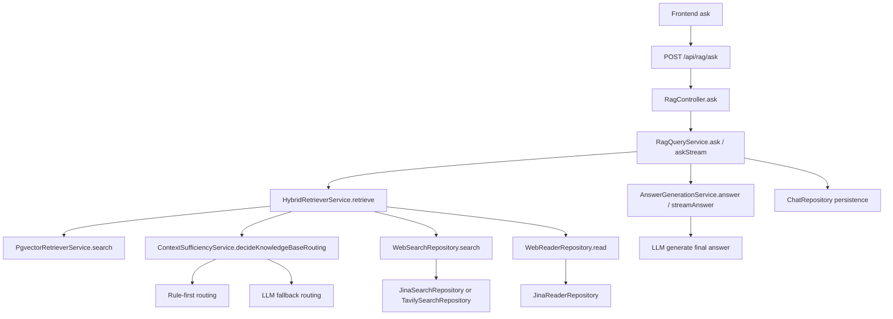

# RAG Routing / Retrieval / Generation Pipeline

这份文档专门描述当前问答链路中 `routing -> retrieval -> generation` 的完整流程，以及主要文件、函数之间的调用关系。

## 目标

当前系统支持两类回答来源：

- 知识库：本地文档 chunk + pgvector
- Web Search：当前默认 `Jina Search + Jina Reader`，后续可切 `Tavily`

系统需要根据问题与知识库召回质量，在 4 种模式之间路由：

- `knowledge_base`
- `search`
- `hybrid`
- `none`

## 高层流程

## 入口文件

### Controller

文件：
- [services/src/modules/rag/rag.controller.ts](/Users/admin/Desktop/works/learn/assistant/services/src/modules/rag/rag.controller.ts)

关键函数：
- `ask(body, request)`

职责：
- 解析请求参数
- 根据 `x-response-mode` / `Accept` 判断 `json` 还是 `stream`
- `json` 时调用 `ragQueryService.ask(...)`
- `stream` 时调用 `ragQueryService.askStream(...)`

## RAG Query 编排

文件：
- [services/src/modules/rag/services/rag-query.service.ts](/Users/admin/Desktop/works/learn/assistant/services/src/modules/rag/services/rag-query.service.ts)

关键函数：
- `ask(question, topK, conversationId)`
- `askStream(question, topK, conversationId)`

职责：
- 调用混合检索器拿到 `retrievalMode + citations`
- 如果有会话，读取历史消息
- 调用回答生成服务
- 把 user / assistant 消息写回会话

`ask(...)` 用于整包返回。  
`askStream(...)` 用于流式返回，返回：

- `initial`
- `stream`
- `persist(answer)`

其中：
- `initial` 用来发 `started` 事件
- `stream` 用来持续发 `delta`
- `persist(answer)` 仅在正常完成时执行

这也是为什么中断生成后不会落库半截 assistant 消息。

## Routing 阶段

文件：
- [services/src/langchain/chains/context-sufficiency.service.ts](/Users/admin/Desktop/works/learn/assistant/services/src/langchain/chains/context-sufficiency.service.ts)

关键函数：
- `decideKnowledgeBaseRouting(question, citations)`

### 规则优先

系统先做规则判断，而不是每次都依赖 LLM：

1. `citations.length === 0`
   - 路由到 `search`
2. `topScore < rag.knowledgeBaseFallbackMinScore`
   - 路由到 `search`
3. 高置信知识库命中足够多
   - 路由到 `knowledge_base`
4. 只有一个弱命中，且低于 `rag.hybridBlendMaxScore`
   - 路由到 `hybrid`
5. 至少有命中，且 `topScore >= rag.knowledgeBaseUseOnlyMinScore`
   - 路由到 `knowledge_base`

### LLM 兜底

如果规则没有给出明确结论，再让模型只返回三选一：

- `KNOWLEDGE_BASE`
- `HYBRID`
- `SEARCH`

## Retrieval 阶段

文件：
- [services/src/langchain/retrievers/hybrid-retriever.service.ts](/Users/admin/Desktop/works/learn/assistant/services/src/langchain/retrievers/hybrid-retriever.service.ts)

关键函数：
- `retrieve(question, topK)`
- `searchWeb(question)`

职责：
- 先调用知识库 retriever
- 再拿 routing decision
- 如有必要再调 web search
- 最终统一产出 `retrievalMode + citations`

### 知识库召回

文件：
- [services/src/langchain/retrievers/pgvector-retriever.service.ts](/Users/admin/Desktop/works/learn/assistant/services/src/langchain/retrievers/pgvector-retriever.service.ts)

关键函数：
- `search(question, topK)`

职责：
- 先对 query 做 embedding
- 在 `document_embeddings` 上做相似度检索
- 返回知识库 citations

### Web Search

接口抽象：
- [services/src/langchain/web/ports/web-search.repository.ts](/Users/admin/Desktop/works/learn/assistant/services/src/langchain/web/ports/web-search.repository.ts)
- [services/src/langchain/web/ports/web-reader.repository.ts](/Users/admin/Desktop/works/learn/assistant/services/src/langchain/web/ports/web-reader.repository.ts)

默认实现：
- [services/src/langchain/web/repositories/jina-search.repository.ts](/Users/admin/Desktop/works/learn/assistant/services/src/langchain/web/repositories/jina-search.repository.ts)
- [services/src/langchain/web/repositories/jina-reader.repository.ts](/Users/admin/Desktop/works/learn/assistant/services/src/langchain/web/repositories/jina-reader.repository.ts)

预留实现：
- [services/src/langchain/web/repositories/tavily-search.repository.ts](/Users/admin/Desktop/works/learn/assistant/services/src/langchain/web/repositories/tavily-search.repository.ts)

当前逻辑：
- 先 search
- 如果 search 结果没有正文，reader 再补抓页面 markdown
- 最后统一映射为 `RagCitation`

## Generation 阶段

文件：
- [services/src/langchain/chains/answer-generation.service.ts](/Users/admin/Desktop/works/learn/assistant/services/src/langchain/chains/answer-generation.service.ts)

关键函数：
- `answer(question, citations, history)`
- `streamAnswer(question, citations, history)`

职责：
- 组织历史消息
- 组织 citations 上下文
- 调用统一的 LLM client provider

`answer(...)`
- 返回完整字符串

`streamAnswer(...)`
- 返回 `Observable<string>`
- 每个 chunk 对应 SSE 的一个 `delta`
- 当前端断开时会触发 `AbortController.abort()`

## LLM Client Provider

抽象文件：
- [services/src/langchain/shared/ports/llm-client.port.ts](/Users/admin/Desktop/works/learn/assistant/services/src/langchain/shared/ports/llm-client.port.ts)

默认实现：
- [services/src/langchain/shared/repositories/openai-client.repository.ts](/Users/admin/Desktop/works/learn/assistant/services/src/langchain/shared/repositories/openai-client.repository.ts)

作用：
- 统一创建 OpenAI-compatible client
- embeddings / routing fallback / answer generation 全都复用同一个 provider 抽象

## 前端响应模式切换

文件：
- [apps/web/src/views/home/index.vue](/Users/admin/Desktop/works/learn/assistant/apps/web/src/views/home/index.vue)
- [apps/web/src/views/home/components/HomeChatArea.vue](/Users/admin/Desktop/works/learn/assistant/apps/web/src/views/home/components/HomeChatArea.vue)

当前支持两种响应模式：

- `stream`
- `json`

规则：
- 前端通过顶部 `stats` 里的“响应模式”切换
- 如果当前正在生成回答，切换按钮禁用
- `stream` 模式走 SSE
- `json` 模式走普通 axios 请求

## 关键配置

文件：
- [services/src/config/rag.config.ts](/Users/admin/Desktop/works/learn/assistant/services/src/config/rag.config.ts)

关键项：
- `RAG_SEARCH_PROVIDER`
- `RAG_MAX_KNOWLEDGE_BASE_RESULTS`
- `RAG_MAX_WEB_RESULTS`
- `RAG_MAX_READER_RESULTS`
- `RAG_KB_FALLBACK_MIN_SCORE`
- `RAG_KB_USE_ONLY_MIN_SCORE`
- `RAG_KB_HIGH_CONFIDENCE_MIN_SCORE`
- `RAG_KB_HIGH_CONFIDENCE_MIN_COUNT`
- `RAG_HYBRID_BLEND_MAX_SCORE`
- `JINA_API_KEY`
- `TAVILY_API_KEY`

## 当前设计结论

这套链路的核心原则是：

- 先尽量使用知识库
- 知识库明显不足时才走 Search
- 知识库有一点但不够完整时走 Hybrid
- 规则优先，模型兜底
- 前端可以显式决定 `stream` 还是 `json`
